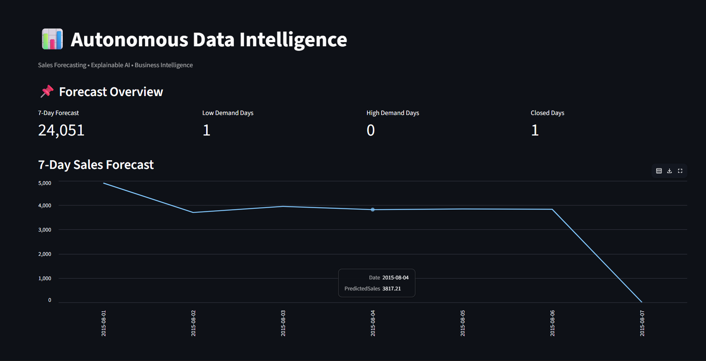
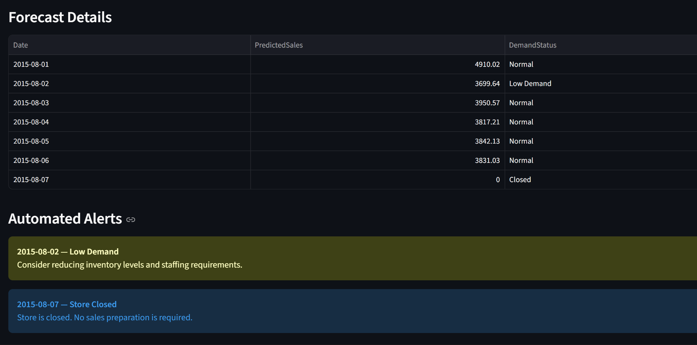
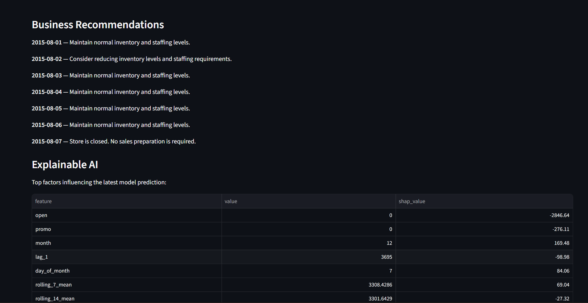

# Autonomous Data Intelligence System

An end-to-end retail sales forecasting and business intelligence system that combines time-series feature engineering, XGBoost forecasting, rolling backtesting, SHAP explainability, automated alerts, FastAPI, and Streamlit.

## Live Demo

- **Live Dashboard:** https://autonomous-data-intelligence-dashboard.onrender.com
- **FastAPI Backend:** https://autonomous-data-intelligence.onrender.com
- **API Documentation:** https://autonomous-data-intelligence.onrender.com/docs
- **API Status:** https://autonomous-data-intelligence.onrender.com/status

> The deployed application demonstrates the complete forecasting-to-intelligence workflow using historical Rossmann retail data. It is not a live production retail monitoring system.

## Overview

Retail businesses need demand forecasts to plan inventory, staffing, and daily operations.

This project builds an automated pipeline that takes historical retail sales data, prepares forecasting features, predicts future demand, validates model performance, explains predictions, and converts model output into business alerts and recommendations.

### System Workflow

Historical Retail Data
        |
        v
Data Preparation / ETL
        |
        v
Feature Engineering
        |
        v
Seasonal Naive + XGBoost
        |
        v
Chronological Evaluation
        |
        v
Rolling Backtesting
        |
        v
Best Forecasting Model
        |
        v
SHAP Explainability
        |
        v
Demand Intelligence
        |
        v
FastAPI Backend
        |
        v
Streamlit Dashboard

## Key Features

- Real-world retail sales dataset
- Automated data preparation and feature engineering
- Seasonal-naive baseline comparison
- XGBoost sales forecasting
- Chronological train/test evaluation
- Expanding-window rolling backtesting
- SHAP-based explainable AI
- Demand classification
- Automated alerts
- Business recommendations
- FastAPI backend
- Streamlit dashboard
- Cloud deployment with separate backend and dashboard services

## Dataset

The project uses the **Rossmann Store Sales** dataset.

The dataset contains historical sales information from 1,115 stores together with store characteristics and business-related variables.

### Main sales fields

- Store
- Date
- Sales
- Customers
- Open
- Promo
- StateHoliday
- SchoolHoliday

### Store information

- StoreType
- Assortment
- CompetitionDistance
- CompetitionOpenSinceMonth
- CompetitionOpenSinceYear
- Promo2
- Promo2SinceWeek
- Promo2SinceYear
- PromoInterval

The dataset covers:

2013-01-01 to 2015-07-31

Dataset source:

**Rossmann Store Sales — Kaggle**

https://www.kaggle.com/datasets/pratyushakar/rossmann-store-sales

The source dataset is public-domain/CC0 as provided by the dataset source.

The full raw dataset is **not included** in this repository.

### Data leakage consideration

The original dataset contains `Customers`, but this variable is not used as a forecasting feature.

Actual future customer counts would not be known at prediction time. Using them would introduce future information into the model and cause data leakage.

The model therefore relies on information that can reasonably be available when generating a forecast, including historical sales, calendar variables, and known business inputs.

## Data Pipeline

The ETL process combines sales records with store-level information and creates calendar features.

The main preparation script:

etl/prepare.py

It:

1. Loads the sales and store datasets.
2. Converts date fields.
3. Normalizes holiday information.
4. Merges sales data with store characteristics.
5. Creates calendar features.
6. Saves the processed dataset.

A smaller Store 1 dataset is generated for cloud deployment using:

etl/prepare_deployment.py

The deployment dataset contains only the historical fields required by the deployed forecasting pipeline.

## Forecasting Model

The forecasting system uses historical sales, calendar information, business indicators, and store characteristics.

### Features

day_of_week
day_of_month
month
year
is_weekend
lag_1
lag_7
rolling_7_mean
rolling_14_mean
promo
is_state_holiday
school_holiday
open
store_type
assortment
competition_distance
promo2

Historical sales features are generated using lagged and rolling values.

For future forecasting, the system uses recursive forecasting: predictions generated for earlier future dates become historical inputs for subsequent forecast steps.

## Baseline Model

A seasonal-naive baseline is used as a benchmark.

The baseline predicts sales using the sales value from the corresponding previous weekly observation.

This provides a simple reference point for determining whether the machine learning model produces meaningful improvement.

## XGBoost Performance

The initial chronological evaluation was performed on **Store 1** using an 80/20 time-ordered split.

| Model | MAE | RMSE |
|---|---:|---:|
| Seasonal Naive | 1209.49 | 1696.92 |
| XGBoost | **297.99** | **405.70** |

XGBoost achieved a:

**75.36% MAE improvement**

over the seasonal-naive baseline on the chronological holdout period.

### Metric interpretation

- **MAE** measures the average absolute prediction error.
- **RMSE** penalizes larger errors more strongly than MAE.

The reported improvement applies specifically to this Store 1 chronological holdout period and should not be interpreted as a universal performance guarantee.

## Rolling Backtesting

A single train/test split can provide an incomplete view of time-series model performance.

To improve evaluation, the project uses expanding-window rolling backtesting across four historical folds.

| Fold | Baseline MAE | XGBoost MAE | Improvement |
|---|---:|---:|---:|
| 1 | 1151.82 | 367.78 | 68.07% |
| 2 | 1120.55 | 400.50 | 64.26% |
| 3 | 1212.30 | 461.87 | 61.90% |
| 4 | 1513.29 | 351.60 | 76.77% |

### Average Backtesting Results

| Model | Average MAE | Average RMSE |
|---|---:|---:|
| Seasonal Naive | 1249.49 | 1575.44 |
| XGBoost | **395.44** | **547.45** |

**Average MAE improvement: 67.75%**

XGBoost outperformed the seasonal-naive baseline across all four evaluation folds for Store 1 open-day demand.

The rolling backtest implementation is:

models/backtest.py

## Explainable AI

SHAP is used to explain individual model predictions.

The system identifies which input features contributed positively or negatively to a prediction.

- Positive SHAP contribution increases the model prediction.
- Negative SHAP contribution decreases the model prediction.

For the latest historical Store 1 prediction, major contributions included:

| Feature | SHAP Contribution |
|---|---:|
| open | +666.43 |
| promo | +434.39 |
| day_of_month | +325.77 |
| day_of_week | +142.59 |
| lag_1 | -110.77 |
| year | -63.40 |
| school_holiday | -56.17 |

The SHAP pipeline is implemented in:

models/xai.py

## Business Intelligence

The forecasting output is converted into business-level intelligence.

Predicted future days are classified as:

- High Demand
- Low Demand
- Normal
- Closed

The system also generates:

- Alerts
- Recommendations
- Explanations

Example:

Low Demand

Recommendation:
Consider reducing inventory levels and staffing requirements.

The business intelligence logic is implemented in:

models/intelligence.py

## API

FastAPI provides the backend service.

### Endpoints

| Endpoint | Purpose |
|---|---|
| `GET /` | Service information |
| `GET /health` | Health check |
| `GET /status` | Pipeline/data availability status |
| `GET /forecast` | Forecast results |
| `GET /intelligence` | Demand intelligence and recommendations |
| `GET /explanation` | SHAP explanation results |

The API automatically executes the forecasting, explainability, and intelligence pipeline during application startup.

Backend implementation:

api.py

### Live API

**API:** https://autonomous-data-intelligence.onrender.com

**Interactive documentation:** https://autonomous-data-intelligence.onrender.com/docs

## Dashboard

The Streamlit dashboard provides a user-facing interface for the intelligence system.

It displays:

- 7-day sales forecast
- Forecast overview
- Demand status
- Automated alerts
- Business recommendations
- SHAP explanations

Dashboard implementation:

dashboard.py

### Live Dashboard

https://autonomous-data-intelligence-dashboard.onrender.com

### Dashboard Screenshots

#### Forecast Overview

#### Forecast Details and Automated Alerts

#### Business Recommendations and Explainable AI

## Project Structure

autonomous_data_intelligence/
|
├── data/
|   └── deployment/
|       └── store1_history.csv
|
├── etl/
|   ├── prepare.py
|   └── prepare_deployment.py
|
├── models/
|   ├── backtest.py
|   ├── forecast.py
|   ├── intelligence.py
|   ├── predict.py
|   ├── rossmann_xgb.json
|   └── xai.py
|
├── api.py
├── dashboard.py
├── requirements.txt
├── .gitignore
└── README.md

## Installation

Clone the repository:

git clone https://github.com/Neshanthanee/autonomous-data-intelligence.git
cd autonomous-data-intelligence

Create a virtual environment:

python -m venv venv

Activate the environment.

### Windows

venv\Scripts\activate

### Linux / macOS

source venv/bin/activate

Install dependencies:

pip install -r requirements.txt

## Running Locally

### 1. Start the FastAPI backend

uvicorn api:app --reload

The API will be available at:

http://127.0.0.1:8000

FastAPI interactive documentation:

http://127.0.0.1:8000/docs

### 2. Start the Streamlit dashboard

Open another terminal, activate the same virtual environment, and run:

streamlit run dashboard.py

The dashboard will be available at:

http://localhost:8501

The dashboard uses the `API_URL` environment variable when a different backend URL is required. If it is not set, it defaults to the local FastAPI server.

## Deployment

The project is deployed using two separate Render web services:

Streamlit Dashboard
        |
        v
FastAPI Backend
        |
        v
Forecasting Pipeline
        |
        +---- XGBoost
        |
        +---- SHAP
        |
        +---- Business Intelligence

### Deployment Services

**Backend**

https://autonomous-data-intelligence.onrender.com

**Dashboard**

https://autonomous-data-intelligence-dashboard.onrender.com

The repository contains a small Store 1 historical dataset under:

data/deployment/

The full raw and processed datasets are excluded from the repository.

## Important Deployment Note

The underlying Rossmann dataset contains historical data ending in 2015.

Therefore, the deployed application demonstrates the complete forecasting and intelligence workflow, but it should not be interpreted as a real-time retail sales monitoring system.

Future business inputs such as promotions, holidays, and store operating status are currently provided as forecast inputs for demonstration purposes.

A production implementation would connect these inputs to live business systems, APIs, or databases.

The current model development and deployment demonstration focuses on **Store 1**. A production-scale version could extend the same architecture to multiple stores.

## Technology Stack

### Programming

- Python

### Data Processing

- Pandas
- NumPy

### Machine Learning

- Scikit-learn
- XGBoost

### Explainable AI

- SHAP

### Backend

- FastAPI
- Uvicorn

### Dashboard

- Streamlit

### Deployment

- Render
- GitHub

## Future Improvements

Potential extensions include:

- Multi-store forecasting
- Automated database ingestion
- Live business input integration
- Automated model retraining
- Forecast confidence intervals
- Model monitoring
- Data drift detection
- Production authentication
- Cloud database integration
- Real-time operational data

## Project Objective

The goal of this project is not only to predict sales, but to demonstrate how machine learning can be integrated into an end-to-end decision-support system.

The system connects:

Data
  ↓
Prediction
  ↓
Validation
  ↓
Explanation
  ↓
Intelligence
  ↓
Decision Support

This project demonstrates practical machine learning engineering, time-series forecasting, explainable AI, API development, dashboard development, and cloud deployment.
